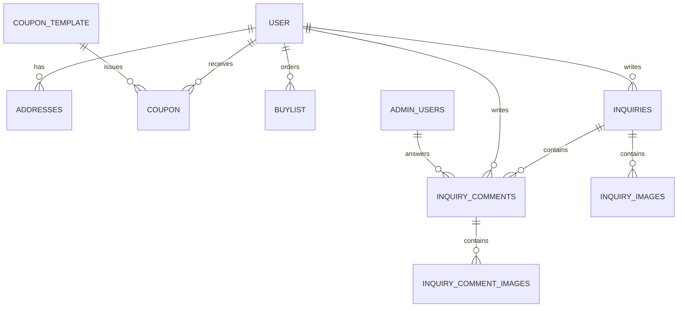

# Shop 데이터베이스 구조

이 문서는 `test_data.sql`과 현재 JPA 엔티티를 기준으로 작성한 `shop` 데이터베이스 구조 문서다.

- DBMS: MySQL 8.x
- 데이터베이스: `shop`
- 스토리지 엔진: InnoDB
- 문자셋: `utf8mb4`
- Collation: `utf8mb4_unicode_ci`
- 스키마 및 초기 데이터 기준 파일: `test_data.sql`

## 테이블 관계



현재 SQL에는 물리적인 `FOREIGN KEY` 제약조건이 선언되어 있지 않다. 위 관계는 애플리케이션에서 사용하는 논리적 관계이며, 각 `user_id`, `inquiry_id`, `comment_id` 인덱스를 통해 조회한다.

## 회원 식별자 구분

| 식별자 | 예시 | 용도 |
|---|---|---|
| `user.user_id` | `5` | DB 내부 PK. 주문, 주소, 쿠폰 등 다른 테이블에서 회원을 연결할 때 사용 |
| `user.access_id` | UUID | 서비스가 발급한 외부 노출용 회원 UUID. JWT의 `sub` 값으로 사용 |
| `user.login_id` | `google:109...` | 로그인 공급자가 제공하는 사용자 식별값. Google 로그인에서는 `google:{Google sub}` 형식 |

`access_id`는 Google Access Token이 아니다. `login_id`는 로그인 공급자 계정을 찾기 위한 값이고, `access_id`는 JWT와 서비스 내부 인증에서 공급자 정보 및 순차 PK를 노출하지 않기 위한 값이므로 각각 역할이 다르다.

## 1. `user`

서비스 회원의 기본 정보와 회원 상태를 저장한다.

| 컬럼 | 타입 | NULL | 기본값 | 제약/의미 |
|---|---|---:|---|---|
| `user_id` | `BIGINT` | N | AUTO_INCREMENT | PK, DB 내부 회원 번호 |
| `access_id` | `VARCHAR(36)` | N | 없음 | UNIQUE, 서비스 회원 UUID, JWT `sub` |
| `name` | `VARCHAR(2048)` | Y | NULL | AES-256-GCM 암호화 회원 이름(한자) |
| `name_kana` | `VARCHAR(2048)` | Y | NULL | AES-256-GCM 암호화 이름 카타카나 |
| `birth_date` | `VARCHAR(255)` | Y | NULL | AES-256-GCM 암호화 생년월일 |
| `gender` | `VARCHAR(2048)` | Y | NULL | AES-256-GCM 암호화 성별 |
| `nickname` | `VARCHAR(100)` | Y | NULL | 서비스 닉네임 |
| `telephone` | `VARCHAR(2048)` | Y | NULL | AES-256-GCM 암호화 일반전화 |
| `login_id` | `VARCHAR(100)` | Y | NULL | UNIQUE, OAuth 로그인 식별자 |
| `deposit_balance` | `INT` | N | `0` | 예치금 잔액 |
| `reward_point` | `INT` | N | `0` | 적립 포인트 |
| `mobile_phone` | `VARCHAR(2048)` | Y | NULL | AES-256-GCM 암호화 휴대전화 |
| `email` | `VARCHAR(2048)` | Y | NULL | AES-256-GCM 암호화 이메일 |
| `completed_order_count` | `INT` | N | `0` | 완료 주문 수 |
| `joined_date` | `DATE` | Y | NULL | 가입일 |
| `member_detail` | `VARCHAR(500)` | N | `일반회원` | 관리자용 회원 메모/회원 구분 |
| `alarm_consent` | `BOOLEAN` | N | `FALSE` | 이벤트 및 알림 수신 동의 |

인덱스:

- `PRIMARY KEY (user_id)`
- `UNIQUE uk_user_access_id (access_id)`
- `UNIQUE uk_user_login_id (login_id)`

신규 Google 회원은 OAuth 인증 직후 최소 정보로 생성되고, 최초 로그인 시 추가정보 화면에서 이름, 생년월일, 성별, 닉네임, 전화번호, 주소 및 알림 동의를 입력한다.

## Refresh Token Redis 저장 구조

서비스 JWT Access Token은 JSON 응답으로만 전달되며 React 메모리에 보관한다. Refresh Token 원본은 HttpOnly Cookie에만 저장하고, 서버 검증 상태는 Redis에 TTL 키로 저장한다.

| Redis 키 | 내용 |
|---|---|
| `shop:auth:refresh:{tokenHash}` | 현재 Refresh Token의 `access_id`와 Token Family ID |
| `shop:auth:used-refresh:{tokenHash}` | 이미 사용한 Refresh Token과 Family ID. 재사용 탐지용 |
| `shop:auth:family:{familyId}` | 해당 Family의 현재 Refresh Token 해시 |
| `shop:auth:family-access:{familyId}` | Family에서 발급한 Access Token `jti` 집합 |
| `shop:auth:active-access:{jti}` | 아직 유효시간이 남은 Access Token |
| `shop:auth:blocked-access:{jti}` | 로그아웃 또는 재사용 탐지로 폐기된 Access Token |
| `shop:auth:revoked-family:{familyId}` | 전체 폐기된 Token Family |

Access Token과 Refresh Token에는 동일한 `sid`(Token Family ID)가 들어간다. 재발급은 Lua 스크립트로 기존 Refresh Token 소비와 사용 완료 표시를 원자적으로 처리한다. 사용 완료된 Refresh Token이 다시 들어오면 최신 Refresh Token을 삭제하고, 같은 Family에서 아직 유효한 모든 Access Token `jti`를 블랙리스트에 추가한다.

## 2. `addresses`

회원 배송지를 저장한다. 최초 추가정보 입력 주소도 이 테이블에 기본 배송지로 생성된다.

| 컬럼 | 타입 | NULL | 기본값/의미 |
|---|---|---:|---|
| `address_id` | `BIGINT` | N | PK, AUTO_INCREMENT |
| `user_id` | `BIGINT` | N | 논리적 FK → `user.user_id` |
| `address_name` | `VARCHAR(2048)` | Y | AES-256-GCM 암호화 배송지 이름 |
| `receiver_name` | `VARCHAR(2048)` | Y | AES-256-GCM 암호화 수령인 이름 |
| `receiver_phone` | `VARCHAR(2048)` | Y | AES-256-GCM 암호화 수령인 연락처 |
| `zip_code` | `VARCHAR(255)` | Y | 우편번호 |
| `province` | `VARCHAR(255)` | Y | 도도부현 |
| `detail_address` | `VARCHAR(2048)` | Y | AES-256-GCM 암호화 상세 주소 |
| `default_address` | `BOOLEAN` | N | `FALSE`, 기본 배송지 여부 |

인덱스: `(user_id, default_address, address_id)`

주소 정보는 중복을 피하기 위해 `user` 테이블에 저장하지 않는다.

## 3. `coupon_template`

관리자가 발급할 쿠폰의 원본 정책을 저장한다.

| 컬럼 | 타입 | NULL | 기본값/의미 |
|---|---|---:|---|
| `coupon_template_id` | `BIGINT` | N | PK, AUTO_INCREMENT |
| `coupon_name` | `VARCHAR(255)` | Y | 쿠폰명 |
| `discount_type` | `VARCHAR(255)` | Y | 할인 방식 |
| `discount_value` | `INT` | N | `0`, 할인 값 |
| `minimum_order_amount` | `INT` | N | `0`, 최소 주문 금액 |
| `started_date` | `DATE` | Y | 사용 시작일 |
| `expired_date` | `DATE` | Y | 만료일 |
| `target_type` | `VARCHAR(255)` | Y | `ALL`, 발급 대상 구분 |
| `active` | `BOOLEAN` | N | `TRUE`, 활성 여부 |
| `created_at` | `DATETIME` | N | 생성 시각 |
| `updated_at` | `DATETIME` | N | 수정 시 자동 갱신 |

인덱스: `(active, started_date, expired_date, coupon_template_id)`

## 4. `coupon`

쿠폰 템플릿을 바탕으로 실제 회원 또는 비회원에게 발급된 쿠폰을 저장한다.

| 컬럼 | 타입 | NULL | 기본값/의미 |
|---|---|---:|---|
| `coupon_id` | `BIGINT` | N | PK, AUTO_INCREMENT |
| `coupon_template_id` | `BIGINT` | Y | 논리적 FK → `coupon_template.coupon_template_id` |
| `user_id` | `BIGINT` | Y | 회원 쿠폰일 때 논리적 FK → `user.user_id` |
| `coupon_name` | `VARCHAR(255)` | Y | 쿠폰명 스냅샷 |
| `discount_type` | `VARCHAR(255)` | Y | 할인 방식 |
| `discount_value` | `INT` | N | `0`, 할인 값 |
| `minimum_order_amount` | `INT` | N | `0`, 최소 주문 금액 |
| `started_date` | `DATE` | Y | 사용 시작일 |
| `expired_date` | `DATE` | Y | 만료일 |
| `issued_at` | `DATETIME` | N | 발급 시각 |
| `used` | `BOOLEAN` | N | `FALSE`, 사용 여부 |
| `used_at` | `DATETIME` | Y | 사용 시각 |
| `coupon_code` | `VARCHAR(255)` | Y | 쿠폰 코드 |
| `guest_identifier` | `VARCHAR(255)` | Y | 비회원 발급 대상 식별자 |

## 5. `buylist`

회원 주문/구매 이력을 저장한다.

| 컬럼 | 타입 | NULL | 기본값/의미 |
|---|---|---:|---|
| `purchase_id` | `BIGINT` | N | PK, AUTO_INCREMENT |
| `user_id` | `BIGINT` | N | 논리적 FK → `user.user_id` |
| `order_number` | `VARCHAR(255)` | Y | 주문 번호 |
| `product_name` | `VARCHAR(255)` | Y | 상품명 |
| `quantity` | `INT` | N | `0`, 수량 |
| `payment_amount` | `INT` | N | `0`, 결제 금액 |
| `order_status` | `VARCHAR(255)` | Y | 주문 상태 |
| `ordered_date` | `DATE` | Y | 주문일 |

인덱스: `(user_id, ordered_date, purchase_id)`

## 6. `inquiries`

회원이 작성한 1:1 문의를 저장한다.

| 컬럼 | 타입 | NULL | 기본값/의미 |
|---|---|---:|---|
| `inquiry_id` | `BIGINT` | N | PK, AUTO_INCREMENT |
| `user_id` | `BIGINT` | N | 논리적 FK → `user.user_id` |
| `title` | `VARCHAR(255)` | Y | 문의 제목 |
| `content` | `LONGTEXT` | Y | 문의 내용 |
| `status` | `BOOLEAN` | N | `FALSE` 미답변, `TRUE` 답변 완료 |
| `created_at` | `VARCHAR(255)` | Y | 작성 시각 문자열 |

인덱스: `(user_id, inquiry_id)`

## 7. `inquiry_comments`

문의에 작성된 회원 댓글 또는 관리자 답변을 저장한다.

| 컬럼 | 타입 | NULL | 기본값/의미 |
|---|---|---:|---|
| `comment_id` | `BIGINT` | N | PK, AUTO_INCREMENT |
| `inquiry_id` | `BIGINT` | N | 논리적 FK → `inquiries.inquiry_id` |
| `user_id` | `BIGINT` | Y | 회원 작성 시 `user.user_id` |
| `admin_id` | `BIGINT` | Y | 관리자 작성 시 `admin_users.admin_id` |
| `writer_type` | `VARCHAR(20)` | N | `USER` 또는 관리자 작성자 구분 |
| `writer_name` | `VARCHAR(255)` | Y | 화면에 표시할 작성자명 |
| `content` | `LONGTEXT` | Y | 댓글/답변 내용 |
| `created_at` | `VARCHAR(255)` | Y | 작성 시각 문자열 |

인덱스: `(inquiry_id, comment_id)`

## 8. `inquiry_images`

문의 본문에 첨부된 이미지를 저장한다.

| 컬럼 | 타입 | NULL | 의미 |
|---|---|---:|---|
| `image_id` | `BIGINT` | N | PK, AUTO_INCREMENT |
| `inquiry_id` | `BIGINT` | N | 논리적 FK → `inquiries.inquiry_id` |
| `image_uuid` | `VARCHAR(36)` | N | UNIQUE, 외부 노출용 이미지 UUID |
| `image_path` | `VARCHAR(255)` | N | 서버에 저장된 이미지 경로/파일명 |

## 9. `inquiry_comment_images`

문의 댓글 또는 관리자 답변에 첨부된 이미지를 저장한다.

| 컬럼 | 타입 | NULL | 의미 |
|---|---|---:|---|
| `comment_image_id` | `BIGINT` | N | PK, AUTO_INCREMENT |
| `comment_id` | `BIGINT` | N | 논리적 FK → `inquiry_comments.comment_id` |
| `image_uuid` | `VARCHAR(36)` | N | UNIQUE, 외부 노출용 이미지 UUID |
| `image_path` | `VARCHAR(255)` | N | 서버에 저장된 이미지 경로/파일명 |

## 10. `admin_users`

관리자 사이트 로그인 계정을 저장한다. 일반 회원 `user` 테이블과 분리되어 있다.

| 컬럼 | 타입 | NULL | 기본값/의미 |
|---|---|---:|---|
| `admin_id` | `BIGINT` | N | PK, AUTO_INCREMENT |
| `login_id` | `VARCHAR(255)` | N | UNIQUE, 관리자 로그인 ID |
| `password_hash` | `VARCHAR(255)` | N | BCrypt 비밀번호 해시 |
| `name` | `VARCHAR(255)` | N | 관리자 이름 |
| `active` | `BOOLEAN` | N | `TRUE`, 계정 활성 여부 |
| `created_at` | `DATETIME` | N | 계정 생성 시각 |

## 인증 데이터 흐름

```text
Google OAuth 성공
  → login_id(`google:{sub}`)로 user 조회
  → 없으면 user 신규 생성(access_id UUID 발급)
  → 서비스 JWT Access Token + Refresh Token 발급
  → JWT Access Token은 JSON 응답으로 전달하고 React 메모리에만 저장
  → Refresh Token 원본은 HttpOnly Cookie, 해시는 Redis TTL 키로 저장
  → 최초 회원이면 additional-info 입력 후 user + addresses 갱신
```

## 스키마 관리 시 주의사항

- 개인정보 암호문은 `enc:{keyVersion}:{payload}` 형식이며 AES-256-GCM, 96비트 랜덤 IV, 128비트 인증 태그를 사용한다.
- 개인정보 암호화 키는 DB나 Git에 저장하지 않고 `PII_ENCRYPTION_KEYS` 환경변수로 주입한다. 키를 분실하면 개인정보를 복호화할 수 없다.
- 기존 평문 데이터 또는 이전 버전 키 데이터는 `PII_MIGRATE_PLAINTEXT_ON_STARTUP=true`로 한 번 마이그레이션한 뒤 운영 환경에서는 비활성화한다.

- `user`는 MySQL 예약어와 충돌할 수 있으므로 SQL에서 `` `user` ``처럼 백틱을 사용한다.
- Google Access Token은 회원 식별이나 로그인 유지에 사용하지 않으며 DB에 저장하지 않는다.
- 토큰 원문을 로그나 일반 응답에 출력하지 않는다.
- `access_id`와 `login_id`의 UNIQUE 제약을 제거하지 않는다.
- 회원 삭제 기능을 추가할 때는 주소, 토큰, 쿠폰, 주문, 문의 등 논리적 하위 데이터를 함께 처리해야 한다.
- 현재 물리적 FK가 없으므로 애플리케이션 또는 정리 작업에서 고아 데이터가 생기지 않도록 주의한다.
- 실제 스키마 변경은 이 문서만 수정하지 말고 `test_data.sql`과 JPA 엔티티에도 동일하게 반영한다.
